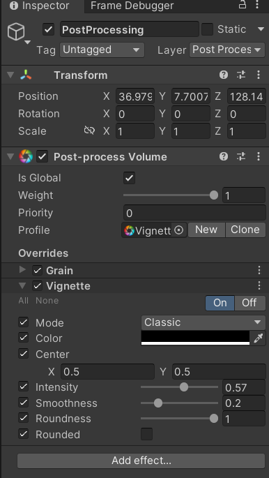
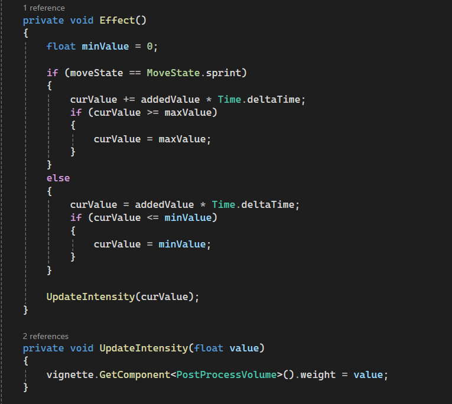

# GDIM33 Vertical Slice
## Milestone 1 Devlog
In my state machine, to switch between the walking animation and the sprint animation, a visual script graph is used. On every frame, the graph first gets the moveState from the playerMovement script. Then, the graph checks if the moveState is equal to the MoveState.sprint. If it is false, the graph will continue to run until the condition is met. If the moveState is equal to MoveState.sprint, the graph will then trigger the transition from the walking state into the sprint state. 

.png>)

In my new breakdown, a new bubble has been added displaying the Player Animation State Machine. This bubble represents the state machine that will handle the animations of the player rig. This state machine transitinos through mutiple states that tell the player animator which bools are true and false that determine what animation is played at the time. Futhurmore, an arrow is pointing from the player bubble to the player animation state machine bubble as the playerMovement script on the player object will directly tell the state machine which state the player is in currently. 

## Milestone 2 Devlog
Complicating factor: 
1. When the player presses R, the player dashes
    1. Get the rigidbody of the player rigidbody object
    2. Detect when the player presses the R key
    3. Apply a force that pushes the player forward
2. When the player dashes, the player has to waits 5 seconds for the next one
    1. Create an inemurator that will make a temporary countdown when called
    2. Detect when the player presses the R key
    3. uses the time inemurator to temparoraly disable the players dash, then reactivate it 

Task Step breakdown
Although i do think that the task step breakdown was helpful for organinizing my thoughts in order to create my complicating factor, i do not think it was helpful actually with building the complicating factor. Since my complicating factor was movement based (fast fall and dashing), it was already vital to the core gameplay of the game, where i would add on the different features while making the intial rough draft. This made the list irrelevant at this stage of the project since i already created the foundation for the system and did not really need to break down how i would get the nessecary componets to finish the factor since most of the were already present.

Although i heavily rely on C# coding for most of the game features, I use visual scripting for smaller operations like setting up UI elements. For instance, my dash icon uses a visual script componet by taking a boolean value from my player movement script and using that in my visual graph. Although im am still testing my UI elemnts and all of them are not fully implemented, i still am using visual graphing to translate C# coding into my UI elements.

Unity System
For my unity system chosen unity system, i decided to use an animator. Since the game is in first person and is hard to see the play animations, the NPC also has two animations for talking and standing idle.

## Milestone 3 Devlog
For my shader graph, im using the built in unity Post Processing Componet. This componet uses several preset post processing effects that can be customized by changing several of the sliders in the inspector. For instance, my game is using the vignette effect within the componet, which makes a dark circle around the screen. When the player starts sprinting, a dark circle will appear around the screen to simulate the vision of the character closing in. 

Post Processing Volume Componet:

Code that makes the visual effect happen:

The main feedback i got from playtesting is that overall level is good and design is good, but several of the mechanics make the game hard to operate. This problem arose from the itch build acting differently than the unity editor. Even if the mechanics of the game were running fine in the unity editor, i would still have problems arise with the camera moving to fast or the player not jumping high enough. After alot of debugging and trying to find a solution, i ended up just ramping up most of the ingame values for player movement that although will make the unity editor game play hard to control, the itch build has a smoother feel to it. 

The main added content i added to the game was continuing the level and creating a finishing state for the game. The level of the game has a new area that will require players to move more vertically, and once the player reaches the top of the last building, the game freezes and displays text to the UI. Furthurmore, i added walls and several props to the beginning lobby of the game and more noticable features to the NPC that the player have to interact to start the game.  

## Milestone 4 Devlog
Milestone 4 Devlog goes here.
## Final Devlog
Final Devlog goes here.
## Open-source assets
Assets
[Character and Animation assets](https://www.mixamo.com/#/)
[City Assets](https://assetstore.unity.com/packages/3d/environments/urban/free-low-poly-simple-urban-city-3d-asset-pack-239474)

Sounds:
[Death Sound](https://www.youtube.com/watch?v=bMwkJ2GYf-s)
[Start Music](https://www.youtube.com/watch?v=KBvXUIQfcbk&list=RDKBvXUIQfcbk&start_radio=1)
[Boost Sound](https://www.youtube.com/watch?v=Ad8hYdBhvjQ)
[Level Music](https://www.youtube.com/watch?v=wwidcxa3fmY&list=RDwwidcxa3fmY&start_radio=1)

