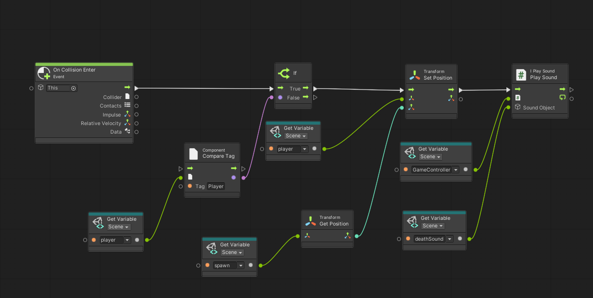
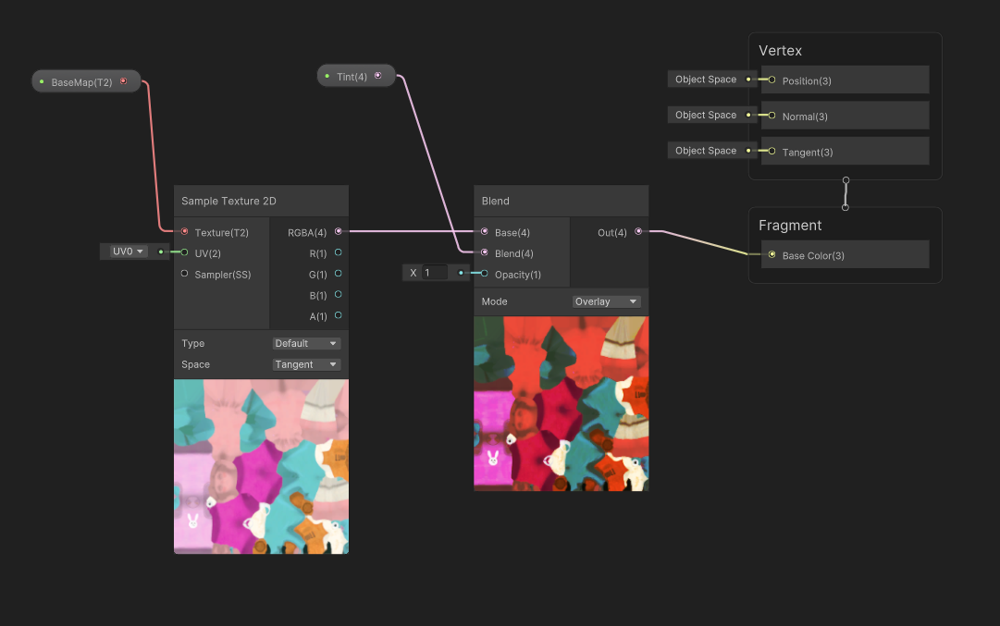
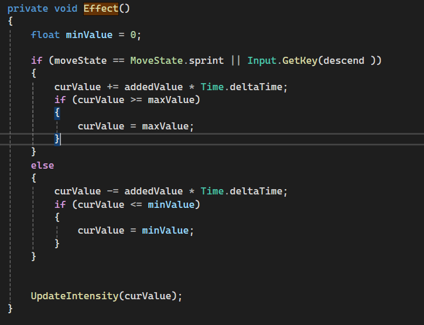

# GDIM33 Vertical Slice
## Milestone 1 Devlog
In my state machine, to switch between the walking animation and the sprint animation, a visual script graph is used. On every frame, the graph first gets the moveState from the playerMovement script. Then, the graph checks if the moveState is equal to the MoveState.sprint. If it is false, the graph will continue to run until the condition is met. If the moveState is equal to MoveState.sprint, the graph will then trigger the transition from the walking state into the sprint state. 

.png>)

In my new breakdown, a new bubble has been added displaying the Player Animation State Machine. This bubble represents the state machine that will handle the animations of the player rig. This state machine transitinos through mutiple states that tell the player animator which bools are true and false that determine what animation is played at the time. Futhurmore, an arrow is pointing from the player bubble to the player animation state machine bubble as the playerMovement script on the player object will directly tell the state machine which state the player is in currently. 

## Milestone 2 Devlog
Complicating factor: 
1. When the player presses R, the player dashes
    1. Get the rigidbody of the player rigidbody object
    2. Detect when the player presses the R key
    3. Apply a force that pushes the player forward
2. When the player dashes, the player has to waits 5 seconds for the next one
    1. Create an inemurator that will make a temporary countdown when called
    2. Detect when the player presses the R key
    3. uses the time inemurator to temparoraly disable the players dash, then reactivate it 

Task Step breakdown
Although i do think that the task step breakdown was helpful for organinizing my thoughts in order to create my complicating factor, i do not think it was helpful actually with building the complicating factor. Since my complicating factor was movement based (fast fall and dashing), it was already vital to the core gameplay of the game, where i would add on the different features while making the intial rough draft. This made the list irrelevant at this stage of the project since i already created the foundation for the system and did not really need to break down how i would get the nessecary componets to finish the factor since most of the were already present.

The task breakdown from this week did help me create my dialogue interaction feature for my NPC. Although i did have an idea of how to do it intially, the task breakdown allowed me to define the objects and componets i needed before even programming. This helped me swiftly complete the feature to add to later in  development.

Although i heavily rely on C# coding for most of the game features, I use visual scripting for smaller operations like setting up UI elements. For instance, whenever a player interacts with the ground or falls out of bounds, a script machine activates that not only sends the player back to the start of the level, but also plays a sound effect for the player restarting the level. This script also bridges the gap between C# and visual scripting since the sound is played through a script that will play the sound effect shortly before removing the prefab to clear up space in the objects of the game.

Unity System
For my unity system chosen unity system, i decided to use an animator. Since the game is in first person and is hard to see the play animations, the NPC also has two animations for talking and standing idle. This is done through a script machine that will keep the NPC idle until the player interacts with the NPC.

## Milestone 3 Devlog
For my shader graph, I am slightly tinting the NPC to have it match with the more orange tint of the game. The shader graph takes the UV map of the NPC, and then mixes the 2D texture with an orange tint. This was done to make a simple shader graph while also making the NPC simliar to the skybox.

The main feedback i got from playtesting is that overall level is good and design is good, but several of the mechanics make the game hard to operate. This problem arose from the itch build acting differently than the unity editor. Even if the mechanics of the game were running fine in the unity editor, i would still have problems arise with the camera moving to fast or the player not jumping high enough. After alot of debugging and trying to find a solution, i ended up just ramping up most of the ingame values for player movement that although will make the unity editor game play hard to control, the itch build has a smoother feel to it. 

The main added content i added to the game was continuing the level and creating a finishing state for the game. The level of the game has a new area that will require players to move more vertically, and once the player reaches the top of the last building, the game freezes and displays text to the UI. Furthurmore, i added walls and several props to the beginning lobby of the game and more noticable features to the NPC that the player have to interact to start the game.  

## Final Devlog
In the current vertical slice game, there are two environments that can be explored. The first is the main lobby area, where there will be an interactable NPC that can start the level with several props lying around. Furthermore, the level itself is a straightforward platformer that uses buildings, cars, and even garbage dumps to highlight the city theme. The core playloop follows the player starting in the lobby, talking to the NPC, climbing through the first stage, and either losing or winning the level to progress, although there is only one level in the vertical slice build.

For my rendering, I chose to use a vignette that will partially cover the screen with a dark circle through the built-in post-processing volume component within Unity. This is activated in two ways. The first way the vignette is activated is that the more the player sprints, when the moveState of the player is the sprinting state, the vignette closes in on the screen until a certain point. This is to show the player emphasizes the change in speed that isn't shown with just the speed value displayed on the player HUD. Additionally, if the player uses the descend mechanic, the screen will also have the vignette close around the screen. This is to highlight the player moving faster, coming down to differentiate them from normally jumping and using the fastfall mechanic. These are both done through a function in the player void that takes the volume of the post-processing component and increases it when the player either sprints or descends, and decreases it when neither happens.

I do intend to use a similar brainstorming process for the task breakdown. For breaking down this project, I like to first brainstorm the core foundation of the game, such as things like movement and general concepts that the game will use. I write the ideas and mechanics I want to incorporate into a list, and then go back and start defining what each idea needs. I then will attempt to intergrate the mechanics that i had put down on my list, while also having room for new ideas and to be added later, and keep iterating that list until i feel satisfied with the mechanic and mark it done. I use this checklist style of process to define the difficulties of each concept through finding out how to get your mechanics to work without programming yet, which often helps me find how possible a mechanic is to create. This helps understand the scope of my games alot as i am able to not only define what i want from a mechanic or concept, but also how comfortable i am with creating the mechanic in the first place. For instance, while brainstorming for I need a Break, i knew i wanted to have a city-themed level. After furthur playtesting and figuring out how my objects affected the player's movement, i started to add different ideas, such as making the player use all the mechanics within the game at least once. I believe that it worked out better than expected, although the level did not pan out how I originally envisioned, I still like the flow and pace the level has and how it pushes the players slightly without making them feel pressured. Although every mechanic did not smoothly intergrate with this style of breakdown and some challenges arose that made it hard to complete, this process helped me stay on task and have multiple different task to work on and figure out.

## Open-source assets
Models and City
[Player](https://www.mixamo.com/#/?page=3&type=Character)
[NPC](https://www.mixamo.com/#/?page=1&type=Character)
[City Assets](https://assetstore.unity.com/packages/3d/environments/urban/free-low-poly-simple-urban-city-3d-asset-pack-239474)

Animations
[Walking](https://www.mixamo.com/#/?page=1&query=Walk&type=Motion%2CMotionPack)
[Running](https://www.mixamo.com/#/?page=1&query=Fast+run&type=Motion%2CMotionPack)
[NPC Jump](https://www.mixamo.com/#/?page=1&query=jump&type=Motion%2CMotionPack)

Sounds:
[Death Sound](https://www.youtube.com/watch?v=bMwkJ2GYf-s)
[Start Music](https://www.youtube.com/watch?v=KBvXUIQfcbk&list=RDKBvXUIQfcbk&start_radio=1)
[Boost Sound](https://www.youtube.com/watch?v=Ad8hYdBhvjQ)
[Level Music](https://www.youtube.com/watch?v=wwidcxa3fmY&list=RDwwidcxa3fmY&start_radio=1)
[Win Sound](https://www.youtube.com/watch?v=d1NjkYjRn34)
[Lose SFX part 1]()
[Lose SFX part 2]()

